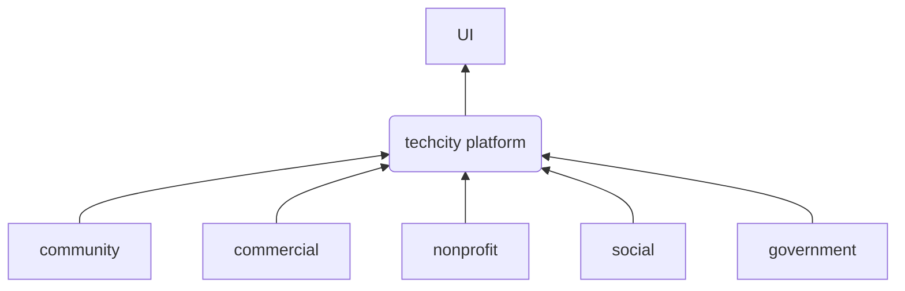

# techcity platform

A technology platform to connect technology interests
in a city together to advance the development of the city

## Why?

Cities like NYC, Austin, and San Francisco are full of tech connections and have a critical mass of technology. In fact, these cities have *so* much tech opportunity that's difficult or impossible to get a consistent effort together because of conflicting direction from competing market forces.

But most cities in America are not like NYC. For every NYC, there are probably 100 Frederick-sized cities (~80k people). A quick Google search shows that the US has 779 cities with >50k and 333 cities with >100k. That would mean that there are 446 cities between 50k-100k.

The opposite problem of the overabundance of tech opportunity can occur in mid-sized cities. Cities struggle to get a critical mass of technology efforts assembled to be a truly notable tech center.

For people who live in these mid-sized cities,
**What could we do to "punch above our weight?"** Furthermore, what could we do to help _other cities like ours_ punch above their weight?

We have to do things that build connections, grow networks, and allow for innovation through collaboration. In other words, we need methods of achieving a critical mass of tech opportunity to make radical growth possible. If we increase the interconnected-ness of the local tech network, then the rate of tech interactions between people increases and there are more chances for good fruit to occur.

Can we achieve this on a city-wide scale?

Platforms are powerful.
The benefits of IaaS make it easier to build on the cloud.
Kubernetes makes large system design possible where it was difficult previously.
Internal platform tools can accelerate the work of a development team massively by removing system complexity from their plate.

The techcity project can bring a software development mindset to the problem of growing a flourishing technical culture in a small to medium sized city. This city building platform focuses on eliminating the barriers that prevent meaningful connection. The platform surfaces connections that were not previously visible.

By focusing on being the technical plumbing for the people, companies, ideas, and community within a city, the platform can help ensure that mid-sized cities stay healthy and thriving places to live.

This diagram presents an aspirational structure that techcity could represent in a future state. The project is building out the core and making connections to community and nonprofit groups with the goal to expand in the future.

## Values

The following list of values describes the core ethos of this project:

* *Connective* - The central idea of techcity is all about connection.
  Connections can trigger the network effect to have outsized impact.
  techcity is focused on creating connections to bring technologists together.
* *Empowering* - The goal of a platform is to provide leverage.
  The platform empowers citizens to spend less time on drudgery
  and more time on the work that impacts their city.
* *Open* - An open model makes it possible to be accessible to any city.
* *Extensible* - Every city has a unique history with its own context.
  An extensible platform permits each city to fit techcity to their situation.
* *Usable* - A system should not be a labyrinth of complexity.
  Such systems hurt accessibility and prevent adoption. Polish matters.
