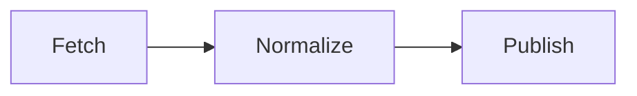

# techcity platform

A technology platform to connect technology interests
in a city together to advance the development of the city

## Values

The following list of values describes the core ethos of this project:

* *Connective* - The central idea of techcity is all about connection.
  Connections can trigger the network effect to have outsized impact.
  techcity is focused on creating connections to bring technologists together.
* *Empowering* - The goal of a platform is to provide leverage.
  The platform empowers citizens to spend less time on drudgery
  and more time on the work that impacts their city.
* *Open* - An open model makes it possible to be accessible to any city.
* *Extensible* - Every city has a unique history with its own context.
  An extensible platform permits each city to fit techcity to their situation.
* *Usable* - A system should not be a labyrinth of complexity.
  Such systems hurt accessibility and prevent adoption. Polish matters.

## Design

The current design of techcity centers around a batch processing mode.
This is a simple operating model that minimizes cost.

The model is:

The batch processing aspect is that this cycle happens nightly
with the GitHub Actions Continuous Integration system.

1. *Fetch* - This stage pulls data from various APIs to look for updates.
2. *Normalize* - The data is processed and stored into data models
   that are a standardized representation.
3. *Publish* - All data is rendered into output that is published
   to GitHub Pages to be exposed as the web-accessible UI.
